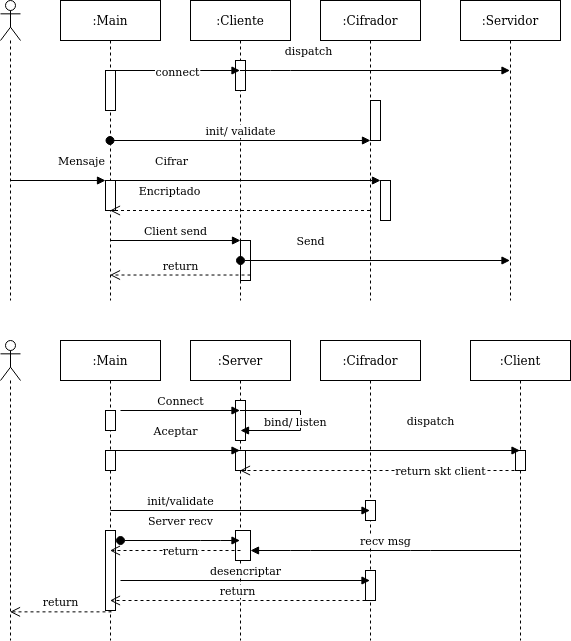

# Taller de programación I 7542

### Nombre y apellido: Lucía Pardo

### Padrón: 99999

### Repositorio: https://github.com/luciaPardo/tp1

### 2do cuatrimestre de 2020


# Cryptosockets

## Introducción: 

Para el presente trabajo práctico se implementó un sistema TCP cliente-servidor implementando además un sistema de cifrado para las comunicaciones.

## Modelo
 
Se comenzó tratando de abstraer lo máximo posible los TDAS, por lo que se crearon por separado los TDAS Cliente, servidor, socket y cifrador. Se quería lograr una comunicación entre el cliente servidor y para esto el cliente no debía saber nada del cliente y viceversa el servidor no tenía por qué saber nada del cliente. Para esto ambas estructuras utilizaron el socket, que era independiente de las dos. Asi mismo el TDA cifrador sólo funciona como encriptador por lo que no le interesaba saber ninguna de las otras implementaciones. 
De esta forma generalizando, el modelo se puede visualizar con el siguiente diagrama:


## Flujo

El flujo del programa comienza inciando en una terminal el servidor (```server_main.c```) especificando el método y la clave a utilizar para encriptar el programa junto con el puerto en donde . La llamada queda de la siguiente forma: 

```./server 8080 --method=cesar --key=5``` 

Una vez inicializado el server se procede en otra terminal a inicializar el cliente, por donde mandaremos el mensaje. Para la llamada indicamos el puerto, el host y el método con su clave de esta forma:

```./client 127.0.0.1 8080 --method=cesar --key=5```

A continuación podemos ver el flujo que mantiene el programa tanto con servidor como con cliente.





Este diagrama intenta ilustrar los pasos que se siguen, pero para mayor claridad se omitieron la creación y destrucción de algunos objetos.


